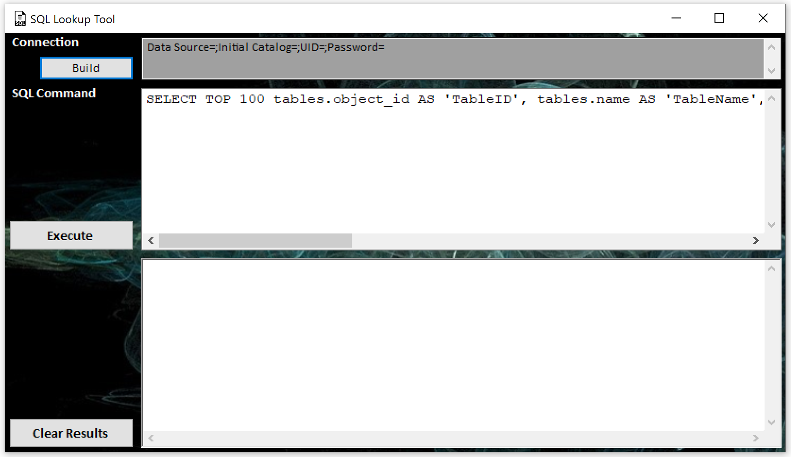
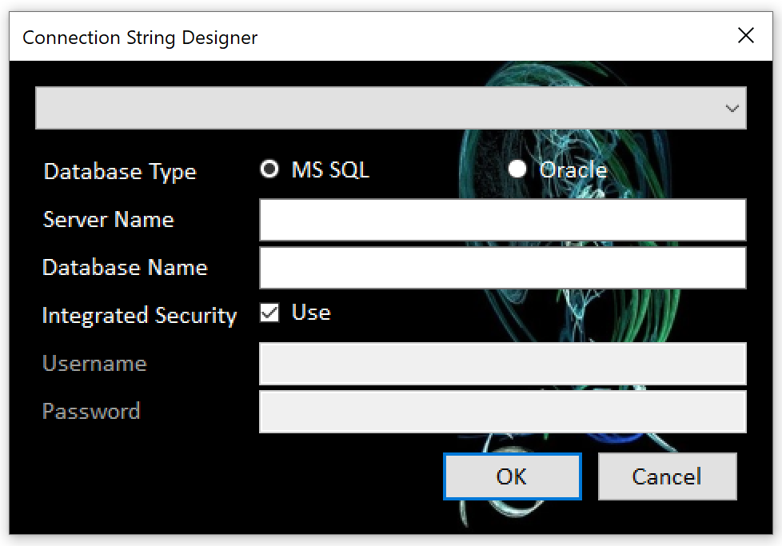

#  TheOwls - SQL Lookup Tool `SQLLookupTool`

MSSQL and Oracle Quick Lookup Tool

## Features

- Connect to MS SQL and Oracle database servers.
- Save Multiple connection informations

## Instructions

### Main Window

1. Enter a connection string or use the `Build` button
2. Enter a valid SQL command
3. Click the `Execute` button to run the command.
4. The results will appended to the bottom window.

> You can use the `Clear Results` button to clean the botton window

### Connection String Designer

1. Select the `Database Type`
2. Enter the `Server Name` and `Database Name`/`Service Name`
3. For `MS SQL` you can select `Integrated Security` if wanted
4. Enter a valid `Username` and `Password` as needed
5. Click `OK` to generate a connection string.

You Connection details will be saved automatically,
and can be selected again from the dropdown list at the top.

> To Remove a saved entry, select from the drop down and press the `DELETE` key.

## Versions

### 2.3.0 (March 2026)

- Fix for oracle connection details saving

### 2.2.0 (March 2026)

- Save Multiple connection details
- converted to C#
- UI improvements (background, icons, etc.)
